# GT-BEHRT-Visit Pipeline cho dữ liệu EHR dạng bảng

**Trạng thái:** Thiết kế, chưa triển khai
**Ngày:** 2026-08-12
**Mục tiêu:** Biểu diễn mỗi lượt bệnh án (`SoBenhAn`) thành một graph và một embedding để truy hồi các ca tương tự.

## Ràng buộc truy cập dữ liệu

Từ ngày 2026-08-13:

- Chỉ được đọc dữ liệu thật trên môi trường/máy được người dùng gọi là
  `vaipe`; SSH host chính xác là `vaipe_aiotlab`.
- Sau khi xác định đúng `vaipe`, có thể tự chủ đọc và thống kê dữ liệu mà
  không cần xin phép lại từng thao tác read-only.
- Dữ liệu thật là read-only; pipeline không được sửa dữ liệu nguồn hoặc ghi
  artifact vào vùng dữ liệu nguồn.
- Dataset được phép đọc là
  `/mnt/disk4/similar_cases_retrieval/data/` trên `vaipe_aiotlab`.
- Không được truy cập server/host khác nếu chưa có xác nhận rõ ràng của người
  dùng.
- Thiết kế schema và thống kê đã ghi dưới đây có thể dùng làm thông tin nền,
  nhưng mọi lần xác minh lại phải đọc từ `vaipe`.

## 1. Phạm vi và quyết định thiết kế

Pipeline này là biến thể của GT-BEHRT dành cho bài toán:

```text
1 SoBenhAn = 1 visit = 1 heterogeneous graph = 1 embedding
```

GT-BEHRT gốc gồm hai bước:

```text
Visit graph → Graph Transformer → visit embedding
Chuỗi visit embedding → BERT → patient embedding
```

Thiết kế của dự án chỉ giữ bước đầu và dừng tại visit embedding:

```text
Visit graph → Heterogeneous Graph Transformer → visit embedding
```

Các quyết định hiện tại:

- Khóa visit chính là `SoBenhAn`.
- Chưa nối các visit thành chuỗi patient vì chưa có `patient_id` được xác minh.
- Mỗi graph độc lập với các graph khác; không tạo cohort graph chứa cả train và test.
- Dùng graph dị thể thưa, không dùng complete graph như GT-BEHRT gốc.
- Embedding đầu ra đề xuất có 256 chiều và được L2-normalize.
- Query và candidate phải được tạo bằng cùng một chính sách thời gian quan sát.
- EHR từ workbook là nhánh lõi; phần mở rộng ảnh + report + EHR được thiết kế
  tại mục 19.

## 2. Tóm tắt dữ liệu đã xác minh

Nguồn dữ liệu trên `vaipe`, được phép truy cập read-only:

```text
/mnt/disk4/similar_cases_retrieval/data/thông tin bệnh án.xlsx
```

Workbook có 5 sheet:

| Sheet | Số dòng | Số cột | Vai trò |
|---|---:|---:|---|
| `thông tin bệnh án` | 3.500 | 114 | Một dòng chính trên mỗi bệnh án/visit |
| `chỉ định DVKT` | 151.248 | 18 | Chỉ định dịch vụ kỹ thuật |
| `Thuốc` | 219.167 | 36 | Các dòng thuốc/toa thuốc |
| `KQCLS` | 312.251 | 18 | Kết quả cận lâm sàng |
| `Phẫu thuật thủ thuật` | 11.342 | 23 | Phẫu thuật và thủ thuật |

Khóa và coverage đã xác minh:

- `SoBenhAn` unique 3.500/3.500 trong sheet chính.
- `SoVaoVien` chỉ có 3.095 giá trị unique nên không dùng làm khóa visit chính.
- Chỉ định, thuốc và kết quả nối về bệnh án theo `SoBenhAn` với row coverage 100%.
- `KQCLS` nối với chỉ định theo `YeuCauChiTiet_Id` với row coverage 100%.
- Phẫu thuật/thủ thuật nối với chỉ định theo `YeuCauChiTiet_Id` với row coverage 100%.

Mật độ event trên mỗi visit:

| Event | Median | P95 | Max |
|---|---:|---:|---:|
| Chỉ định | 32 | 120 | 625 |
| Dòng thuốc | 42 | 204,45 | 606 |
| Kết quả CLS | 55 | 295,4 | 1.616 |

Mật độ này làm complete graph không phù hợp. Riêng 1.616 node đã sinh hơn 1,3 triệu cạnh nếu nối từng cặp node.

## 3. Pipeline tổng thể

```mermaid
flowchart LR
    A["Workbook EHR: 5 sheets"] --> B["Schema và key validation"]
    B --> C["Canonical visits/events/relations"]
    C --> D["Snapshot và leakage filter"]
    D --> E["Một heterogeneous graph / SoBenhAn"]
    E --> F["Node feature encoders"]
    F --> G["Sparse Graph Transformer / HGT"]
    G --> H["VISIT readout"]
    H --> I["Embedding 256 chiều"]
    I --> J["Cosine retrieval index"]
```



Các stage dự kiến:

1. Ingest workbook ở chế độ read-only trên server.
2. Kiểm tra schema, kiểu dữ liệu và khóa liên kết.
3. Chuẩn hóa thành các bảng canonical.
4. Áp dụng snapshot/cutoff và feature whitelist.
5. Tạo một heterogeneous graph cho mỗi `SoBenhAn`.
6. Mã hóa feature theo node type.
7. Pretrain Graph Transformer.
8. Fine-tune cho similarity nếu có nhãn cặp tương tự.
9. Sinh và lưu visit embeddings.
10. Xây retrieval index và đánh giá top-k.

## 4. Canonical data model

Không đưa trực tiếp 114 cột vào GNN. Workbook cần được chuẩn hóa thành ba bảng chính.

### 4.1 `visits.parquet`

Một dòng trên mỗi `SoBenhAn`:

```text
visit_id
admission_time
discharge_time
department
snapshot_mode
cutoff_time
split
static_numeric_features
static_categorical_features
source_row_hash
```

### 4.2 `events.parquet`

Một dòng trên mỗi clinical event:

```text
event_id
visit_id
event_type
concept_id
concept_name
event_time
numeric_value
text_value
unit
reference_low
reference_high
comparison_operator
abnormal_flag
missing_mask
order_id
prescription_id
source_sheet
source_row_hash
```

### 4.3 `relations.parquet`

```text
source_event_id
relation_type
target_event_id
visit_id
```

### 4.4 Train-only artifacts

Các artifact sau chỉ được fit từ train split:

- Vocabulary của concept/node type.
- Thống kê chuẩn hóa numeric value.
- Mapping đơn vị xét nghiệm.
- Text normalization rules nếu có học từ dữ liệu.
- Graph augmentation statistics.

## 5. Mapping từng sheet

### 5.1 `thông tin bệnh án`

Sinh các node:

- `VISIT`: đúng một node trên mỗi `SoBenhAn`.
- `TEXT_SECTION`: mỗi section lâm sàng được phép dùng là một node.
- `VITAL`: một node trên mỗi phép đo có giá trị.
- `DIAGNOSIS`: chỉ sinh từ chẩn đoán/code được phép dùng tại snapshot.

Feature ứng viên của `VISIT`:

- `NgayVaoVien`.
- `TenPhongBan`.
- Các categorical context đã được phê duyệt.
- Các mask cho modality có/không có dữ liệu.

`TEXT_SECTION` ứng viên:

- `LyDoVaoVien`.
- `QuaTrinhBenhLy`.
- `TienSuBanThan`.
- `TienSuGiaDinh`.
- `DiUng`.
- `KhamBenhToanThan`.
- Các section khám cơ quan.
- `TomTatBenhAn` chỉ dùng nếu xác nhận nó có sẵn tại thời điểm query.

`VITAL` ứng viên:

- `Mach`.
- `NhipTho`.
- `NhietDo`.
- `CanNang`.
- `ChieuCao`.
- `HuyetApCao`.
- `HuyetApThap`.

Các trường tạm khóa khỏi admission/early snapshot vì có nguy cơ leakage:

- `NgayRaVien`.
- `ChanDoanRaVien`.
- `ketquadieutri`.
- `PhuongPhapDieuTri` và các trường phương pháp điều trị sau diễn biến.
- `TinhTrangNguoiBenhRaVien`.
- `HuongDieuTriVaCheDoTiepTheo`.
- `ChanDoanSauPhauThuat`.
- `TongSoNgayDieuTriSauPhauThuat`.
- `TongSoLanPhauThuat`.
- Các trường tai biến và kết quả sau điều trị.

`MaICD` và `ICD_phu` chỉ được dùng sau khi data owner xác nhận chúng là thông tin có sẵn tại snapshot, không phải chẩn đoán ra viện.

### 5.2 `chỉ định DVKT`

Mỗi `YeuCauChiTiet_Id` tạo một node `ORDER`.

Feature ứng viên:

- `TenDichVu`.
- `NgayYeuCau`.
- `TenPhongBan`.
- `ChanDoan` tại thời điểm yêu cầu, nếu timestamp hợp lệ.
- `loaimau`.
- `ViTriMau`.
- `KichThuocBuou` sau khi xác minh kiểu và ý nghĩa.

Không dùng tên bệnh nhân, năm sinh và giới tính lặp lại từ sheet này nếu chúng đã có ở nguồn visit được phê duyệt.

### 5.3 `Thuốc`

Sinh hai cấp node:

- `PRESCRIPTION`: nhóm theo visit/toa thuốc.
- `MEDICATION`: mỗi dòng thuốc sau deduplication là một node.

Feature ứng viên của `MEDICATION`:

- `TenDuoc`.
- `TenHoatChat`.
- `DuongDung`.
- `DonViTinh`.
- `SoNgay`.
- `SoLuongTong`.
- `strSLSang`, `strSLTrua`, `strSLChieu`, `strSLToi`.
- `NgayKham` sau khi parse timestamp.
- `LoiDan` nếu được phép dùng text.

Loại khỏi model feature:

- Tên bệnh nhân.
- Địa chỉ.
- Số BHYT.
- Bác sĩ.
- Người liên hệ.
- Các ID hành chính không có nghĩa lâm sàng.

`HamLuong` hiện chỉ có một giá trị unique trong profile và không mang signal phân biệt ở phiên bản dữ liệu này; mặc định loại khỏi feature cho đến khi kiểm tra lại nguồn.

### 5.4 `KQCLS`

Mỗi dòng kết quả tạo một node `LAB_RESULT`.

Feature ứng viên:

- `MA_DICH_VU`.
- `TEN_CHI_SO`.
- `GIA_TRI`.
- `khoang_tham_chieu`.
- `DON_VI_DO`.
- `MO_TA`.
- `KET_LUAN`.
- `NGAY_KQ`.
- `LoaiMau`.
- `chat_luong_mau`.

Loại khỏi feature:

- `MA_BS_DOC_KQ`.
- ID hành chính không biểu diễn trạng thái lâm sàng.

Node `LAB_RESULT` được nối với `ORDER` bằng `YeuCauChiTiet_Id`.

### 5.5 `Phẫu thuật thủ thuật`

Mỗi dòng tạo một node `PROCEDURE`.

Feature ứng viên:

- `TenDichVu` hoặc `ten_dich_vu` sau khi giải quyết cột trùng nghĩa.
- `ICD_TruocPhauThuat_MoTa`.
- `CanThiepPhauThuat`.
- `LoaiPhauThuat`.
- `pp_vocam`.
- `TrinhTuThucHien_Text` nếu nằm trong snapshot.
- `DanLuu`.
- `ThoiGianBatDau`.
- `ThoiGianKetThuc`.
- `LoaiPT_TT`.

Các trường sau có thể là post-event information và phải lọc theo snapshot:

- `ICD_SauPhauThuat_MoTa`.
- `KetQua`.
- `NgayCatChi`.
- `NgayRut`.

Liên kết về visit:

```text
PROCEDURE.YeuCauChiTiet_Id
  → ORDER.YeuCauChiTiet_Id
  → ORDER.SoBenhAn
```

## 6. Graph schema

### 6.1 Node types

```text
VISIT                 1 node
TEXT_SECTION          0..n nodes
VITAL                 0..n nodes
DIAGNOSIS             0..n nodes
ORDER                 1..n nodes
LAB_RESULT            0..n nodes
PRESCRIPTION          0..n nodes
MEDICATION            0..n nodes
PROCEDURE             0..n nodes
```

### 6.2 Edge types

```text
VISIT --has_text----------> TEXT_SECTION
VISIT --has_vital---------> VITAL
VISIT --has_diagnosis-----> DIAGNOSIS
VISIT --has_order---------> ORDER
VISIT --has_prescription--> PRESCRIPTION

ORDER --has_result--------> LAB_RESULT
ORDER --has_procedure-----> PROCEDURE
PRESCRIPTION --has_drug---> MEDICATION

LAB_RESULT --next_same_test--> LAB_RESULT
```

Mỗi relation cần reverse edge tương ứng để message passing hai chiều.

Nút `VISIT` có thể có cạnh trực tiếp đến tất cả event quan trọng ngoài các cạnh phân cấp. Cạnh trực tiếp giúp readout nhận thông tin sau một hop; cạnh phân cấp giữ cấu trúc nghiệp vụ thật.

Không tạo cạnh giữa mọi cặp event. Không tạo cạnh giữa các visit khác nhau trong phiên bản này.

### 6.3 Temporal edges

Chỉ tạo `next_same_test` giữa hai kết quả liên tiếp thỏa:

```text
same visit_id
same normalized TEN_CHI_SO
valid event_time
```

Không nối một event với tất cả event trước đó vì số cạnh tăng theo `O(N²)`.

## 7. Preprocessing chi tiết

### 7.1 ID và privacy

- `SoBenhAn`, `YeuCauChiTiet_Id` và các khóa chỉ dùng để join và trace lineage.
- Không embed trực tiếp các ID này.
- Không dùng tên, địa chỉ, số BHYT, mã bác sĩ hoặc người liên hệ làm feature.
- Không ghi raw clinical text hoặc direct identifier vào log.
- `source_row_hash` dùng để debug/reproducibility mà không lưu row content trong log.

### 7.2 Deduplication

Deduplication phải deterministic và ghi count:

- Giữ một row nếu toàn bộ feature lâm sàng và timestamp giống nhau.
- Thêm `duplicate_count` vào node feature nếu nhiều row được gộp.
- Không gộp hai phép đo cùng loại ở thời điểm khác nhau.
- Không gộp kết quả khác nhau chỉ vì chung `YeuCauChiTiet_Id`.

### 7.3 Lab parsing

Parser `GIA_TRI` cần phân biệt:

- Số thực thông thường.
- Giá trị có dấu `<`, `<=`, `>`, `>=`.
- Khoảng giá trị.
- Giá trị categorical như âm tính/dương tính.
- Text hoặc giá trị không parse được.

Đầu ra đề xuất:

```text
numeric_value
comparison_operator
categorical_value
parse_success
```

Không thay giá trị không parse được bằng 0.

### 7.4 Numeric normalization

Lab được chuẩn hóa theo:

```text
(normalized_test_name, normalized_unit)
```

Khuyến nghị:

```text
value_norm = clip((value - train_median) / train_IQR, -5, 5)
```

Nếu không đủ mẫu cho một `(test, unit)`, fallback theo test hoặc global robust statistics và ghi lại fallback level.

Ngoài giá trị chuẩn hóa, tạo:

- `below_reference`.
- `within_reference`.
- `above_reference`.
- `reference_unknown`.

### 7.5 Time normalization

Mỗi event có:

```text
delta_hours = event_time - admission_time
```

`delta_hours` được đưa qua Time2Vec 16 hoặc 32 chiều.

Với procedure:

```text
duration_minutes = end_time - start_time
```

Trước khi dùng cutoff 24 giờ, phải audit format và precision của `NgayKham`, `NgayYeuCau`, `NGAY_KQ`, `ThoiGianBatDau` và `ThoiGianKetThuc`.

### 7.6 Text normalization

- Chuẩn hóa Unicode và khoảng trắng.
- Không thay đổi nội dung lâm sàng bằng rule không được kiểm chứng.
- Cache text embedding theo hash của normalized text.
- Giai đoạn đầu freeze text encoder; chỉ train projection vào `d_model`.

## 8. Node feature encoders

Tất cả node type được project về `d_model = 256`.

### 8.1 Shared components

```yaml
node_type_embedding_dim: 16
source_embedding_dim: 8
concept_embedding_dim: 64
time_embedding_dim: 32
numeric_projection_dim: 32
text_projection_dim: 128
model_dimension: 256
```

### 8.2 Concept encoding

Các vocabulary chính hiện có quy mô vừa phải:

- `TenDichVu`: khoảng 860 giá trị trong sheet chỉ định.
- `TenDuoc`: khoảng 798.
- `TenHoatChat`: khoảng 363.
- `TEN_CHI_SO`: khoảng 505.

Mỗi concept dùng:

```text
learned concept ID embedding
+ text embedding của tên/mô tả
+ node type embedding
```

Concept chưa gặp trong train dùng text embedding và `UNK` ID thay vì bị loại hoàn toàn.

### 8.3 Numeric node encoding

```text
[value_norm,
 missing_mask,
 parse_success,
 comparison_operator,
 reference_position,
 duplicate_count]
→ small MLP
```

### 8.4 Text node encoding

```text
frozen clinical/Vietnamese text encoder
→ cached text vector
→ trainable projection
→ 128 dimensions
```

Model cụ thể cho text chưa được chốt trong tài liệu này. Việc chọn model phải dựa trên hỗ trợ tiếng Việt, khả năng xử lý clinical text và quy định không upload dữ liệu ra ngoài.

## 9. GT-BEHRT-Visit architecture

Cấu hình khởi điểm:

```yaml
model:
  name: gt_behrt_visit
  architecture: heterogeneous_graph_transformer
  graph_type: sparse_heterogeneous
  layers: 2
  attention_heads: 4
  hidden_dimension: 256
  dropout: 0.2
  residual_connections: true
  layer_normalization: true
  output_dimension: 256
  l2_normalize_output: true
```

Hai layer cho phép message passing theo các đường:

```text
LAB_RESULT → ORDER → VISIT
PROCEDURE → ORDER → VISIT
MEDICATION → PRESCRIPTION → VISIT
```

Nếu `VISIT` nối trực tiếp với event, một layer đã truyền được event information; layer thứ hai giúp kết hợp event-event context qua `VISIT` và các node trung gian.

### 9.1 Readout

Nút `VISIT` đóng vai trò tương đương `<VST>` của GT-BEHRT.

```text
h_visit = hidden state cuối của VISIT
h_pool  = attention pooling trên tất cả event nodes
z_visit = L2Normalize(MLP(concat(h_visit, h_pool)))
```

Công thức:

\[
z_v = \operatorname{L2Norm}\left(
  \operatorname{MLP}\left[
    h^{(L)}_{\mathrm{VISIT}}
    \;\Vert\;
    \operatorname{AttentionPool}(H^{(L)}_{\mathrm{events}})
  \right]
\right)
\]

Ablation bắt buộc:

1. Chỉ `h_visit`.
2. Chỉ graph pooling.
3. `h_visit || graph pooling`.

### 9.2 Variable-size batching

Không batch chỉ theo số graph. Dùng budget theo tổng node/edge:

```text
max_nodes_per_batch
max_edges_per_batch
```

Các graph cực lớn có thể chạy batch size 1. Không truncate event một cách tùy ý trước khi chứng minh cần thiết.

Nếu cần giảm kích thước, ưu tiên hierarchical aggregation có thể tái lập:

- Group lab theo order/test/time bucket.
- Group medication theo prescription/drug.
- Lưu count, min, max, first, last và span thời gian.

## 10. Training objectives

### 10.1 Stage 1: Node Attribute Masking

Theo ý tưởng pretraining của GT-BEHRT:

- Mask khoảng 15% concept hoặc node attributes.
- Dự đoán lại concept trong đúng vocabulary của node type.
- Mask numeric value và hồi quy lại normalized value.
- Mask một phần text representation nếu có objective phù hợp.

```text
L_stage1 = L_mask_concept + λ_num L_mask_numeric + λ_text L_mask_text
```

Không dùng ID liên kết làm prediction target.

### 10.2 Stage 2: Relation prediction

Ẩn một tỷ lệ cạnh rồi dự đoán quan hệ:

```text
ORDER --has_result--> LAB_RESULT
ORDER --has_procedure--> PROCEDURE
PRESCRIPTION --has_drug--> MEDICATION
```

Negative edge phải được lấy trong cùng visit và tôn trọng node type để tránh negative quá dễ.

### 10.3 Stage 3: Visit-level self-supervision

Tạo hai view của cùng visit bằng augmentation an toàn:

- Mask một phần thuộc tính.
- Drop một số cạnh trực tiếp `VISIT → event` dư thừa.
- Giữ các cạnh nghiệp vụ chính như `ORDER → LAB_RESULT`.
- Không xóa toàn bộ một modality.
- Không tạo hoặc sửa giá trị lâm sàng tùy ý.

Khuyến nghị dùng VICReg hoặc Barlow Twins thay cho InfoNCE thuần. Lý do: hai visit khác nhau vẫn có thể là hai ca bệnh thật sự tương tự; coi mọi visit khác là negative có thể làm hỏng không gian retrieval.

### 10.4 Stage 4: Similarity fine-tuning

Chỉ thực hiện sau khi định nghĩa positive/negative pair được phê duyệt.

Các lựa chọn:

- Supervised contrastive loss.
- Triplet loss với hard-negative mining.
- Pairwise similarity classification/regression.

Không tự định nghĩa hai ca tương tự chỉ bằng cùng `MaICD` trước khi xác nhận ý nghĩa clinical và snapshot của trường này.

## 11. Snapshot và chống leakage

Pipeline phải hỗ trợ:

```yaml
snapshot:
  mode: admission | first_24h | full_visit
  cutoff_time: optional
```

### 11.1 Admission snapshot

Chỉ dùng thông tin có sẵn khi nhập viện, ví dụ lý do vào viện, tiền sử, khám và vital ban đầu.

### 11.2 First-24h snapshot

Chỉ giữ event thỏa:

```text
admission_time <= event_time <= admission_time + 24 hours
```

Chỉ bật chế độ này sau khi audit timestamp.

### 11.3 Full-visit snapshot

Dùng cho retrospective retrieval, không được trình bày như một hệ thống query-time/admission decision support.

### 11.4 Query/candidate symmetry

Phiên bản đầu phải dùng cùng observation policy cho hai phía:

```text
query first-24h ↔ candidate first-24h
```

Không dùng query 24 giờ đầu để so trực tiếp với candidate embedding chứa toàn bộ diễn biến và outcome.

Outcome có thể được lưu làm metadata để hiển thị hoặc đánh giá sau retrieval, nhưng không được đưa vào encoder nếu không có tại thời điểm query.

## 12. Split strategy

Yêu cầu ưu tiên:

1. Nhận một `patient_id` đã pseudonymize từ data owner.
2. Split theo patient trước khi fit vocabulary và normalization.
3. Mọi visit của một patient chỉ xuất hiện trong một split.
4. Ghi seed, split rule và số patient/visit từng split vào manifest.

Nếu chưa có patient ID:

- Chỉ có thể dùng visit-disjoint hoặc temporal split.
- Phải ghi rõ nguy cơ cùng patient xuất hiện ở nhiều split.
- Không suy ngược patient ID từ tên, địa chỉ, số BHYT hoặc demographics.

## 13. Retrieval

Embedding được lưu theo contract:

```text
visit_id
split
snapshot_mode
cutoff_time
embedding_version
embedding: float32[256]
```

Similarity:

\[
\operatorname{score}(q,c) = z_q^T z_c
\]

Vì các vector đã L2-normalize, dot product tương đương cosine similarity.

Index có thể dùng exact cosine search ở quy mô 3.500 visit. Chưa cần approximate nearest neighbor ở phiên bản đầu; ANN/FAISS chỉ cần khi kho dữ liệu tăng đáng kể.

Candidate filters cần hỗ trợ:

- Chỉ lấy candidate trong reference/train cohort.
- Loại chính query visit.
- Lọc theo snapshot/embedding version.
- Lọc theo điều kiện cohort đã được phê duyệt nếu có.

## 14. Evaluation

### 14.1 Retrieval metrics

- `Precision@k`.
- `Recall@k`.
- `mAP@k`.
- `nDCG@k`.
- Đánh giá top-k bởi chuyên gia y tế nếu có.

Các metric này chỉ có ý nghĩa sau khi định nghĩa relevance/similarity label.

### 14.2 Baselines bắt buộc

1. Tabular aggregation + MLP.
2. DeepSets hoặc attention pooling, không dùng graph edges.
3. Sparse GT-BEHRT-Visit.
4. GT-BEHRT-Visit bỏ time features.
5. GT-BEHRT-Visit bỏ quan hệ `ORDER → LAB_RESULT`.
6. GT-BEHRT-Visit bỏ text nodes.
7. Chỉ dùng `VISIT` readout so với `VISIT + attention pooling`.

Graph model chỉ được coi là có giá trị nếu vượt baseline dùng cùng input feature và cùng split.

### 14.3 Data/graph validation

Trước training cần kiểm tra:

- Mỗi graph có đúng một `VISIT` node.
- Mọi event thuộc đúng `SoBenhAn`.
- Mọi procedure/result có `YeuCauChiTiet_Id` hợp lệ hoặc được ghi rõ unmatched.
- Không có event sau cutoff trong early snapshot.
- Không có direct identifier trong feature tensor hoặc log.
- Không fit vocabulary/statistics từ validation/test.
- Không có patient overlap giữa split nếu patient ID đã có.
- Distribution số node/edge theo split.
- Tỷ lệ parse numeric lab và timestamp.

## 15. Explainability

Attention weight không được mặc định coi là lời giải thích lâm sàng.

Phiên bản đầu nên hỗ trợ node occlusion:

1. Tính embedding đầy đủ của query.
2. Mask từng nhóm node/event.
3. Đo mức thay đổi cosine score với candidate.
4. Trả về các event làm similarity score thay đổi nhiều nhất.

Chỉ hiển thị thông tin được phép; không đưa direct identifier hoặc raw sensitive text vào explanation log.

## 16. Artifacts dự kiến

```text
ehr_graph_preprocessed/
├── visits.parquet
├── events.parquet
├── relations.parquet
├── split_manifest.json
├── concept_vocab.json
├── unit_vocab.json
├── numeric_stats.json
├── text_embedding_manifest.json
└── preprocessing_manifest.json

ehr_graph_dataset/
├── graphs/
├── graph_index.parquet
└── graph_manifest.json

ehr_graph_model/
├── gt_behrt_visit.pt
├── model_config.yaml
├── training_manifest.json
└── validation_metrics.json

ehr_graph_embeddings/
├── visit_embeddings.parquet
├── embedding_manifest.json
└── retrieval_evaluation.json
```

Manifest phải ghi:

- Dataset path và SHA-256/version.
- Git commit hash.
- Snapshot mode và cutoff.
- Split rule và random seed.
- Vocabulary/statistics version.
- Model configuration.
- Dependency/model versions.
- Command chạy và hostname.

Không commit các artifact dữ liệu, graph, embedding, checkpoint hoặc log chứa thông tin bệnh án.

## 17. Gợi ý module khi triển khai

Đây là cấu trúc đề xuất, chưa tồn tại:

```text
code/ehr_graph_pipeline/
├── config/
│   ├── data_schema.yaml
│   ├── feature_policy.yaml
│   └── model.yaml
├── ingest_workbook.py
├── build_canonical_events.py
├── apply_snapshot.py
├── build_visit_graphs.py
├── node_encoders.py
├── gt_behrt_visit.py
├── pretrain_graph_encoder.py
├── train_similarity.py
├── embed_visits.py
├── retrieve_visits.py
├── evaluate_retrieval.py
└── tests/
```

Triển khai và smoke test nhỏ trên local chỉ dùng fixture giả, không chứa dữ liệu bệnh nhân. Được SSH vào `vaipe_aiotlab` để profile schema và kiểm tra linkage ở chế độ read-only. Preprocessing, training, embedding hoặc ghi artifact trên `vaipe` chỉ thực hiện khi người dùng cho phép rõ ràng; tuyệt đối không ghi vào dataset root.

Không dùng server/host khác và không tự chọn environment thay thế nếu môi
trường chạy chưa được xác định.

## 18. Thứ tự triển khai đề xuất

### Milestone 1: Data contract

- Viết schema config cho 5 sheet.
- Chuẩn hóa field names và timestamp.
- Sinh `visits/events/relations`.
- Viết validation cho join coverage và leakage cutoff.

### Milestone 2: Graph builder

- Tạo graph theo `SoBenhAn`.
- Tạo node/edge type và reverse edges.
- Kiểm tra distribution số node/edge.
- Tạo fixture graph giả cho unit test.

### Milestone 3: Encoder baseline

- Implement node encoders.
- Implement 2-layer HGT.
- Sinh embedding với untrained model chỉ để kiểm tra contract, không dùng làm retrieval result.

### Milestone 4: Self-supervised pretraining

- Node attribute masking.
- Relation prediction.
- Visit-level VICReg.
- Theo dõi loss và kiểm tra representation collapse.

### Milestone 5: Retrieval evaluation

- Định nghĩa relevance label.
- Implement exact cosine retrieval.
- Chạy baseline và ablation.
- Báo cáo `Recall@k`, `mAP@k`, `nDCG@k`.

## 19. Mở rộng đa phương thức: ảnh + report + EHR

### 19.1. Đơn vị merge

Đơn vị cuối cùng vẫn là một visit:

```text
1 visit
├── 1 EHR graph
├── 0..N imaging studies
└── 0..N reports
        ↓
1 multimodal visit embedding
```

Không ghép report với từng file/lát cắt DICOM. Report phải được ghép với
`imaging study`, sau đó study mới được quy về visit. Một visit có thể không
có ảnh hoặc report; không loại visit và không tạo liên kết giả để ép đủ ba
modality.

### 19.2. Hai tầng liên kết

Việc merge phải diễn ra qua hai bảng ánh xạ tách biệt:

```text
EHR visit ── visit_study_map ── imaging study
                                  │
                                  └── study_report_map ── report
```

`visit_study_map`:

| Trường | Ý nghĩa |
|---|---|
| `visit_id` | Khóa visit chuẩn, hiện đề xuất là `SoBenhAn` |
| `study_uid` | `StudyInstanceUID` hoặc study ID nội bộ đã pseudonymize |
| `order_id` | ID chỉ định/DVKT nếu có |
| `accession_number` | Mã lần chụp từ DICOM nếu có |
| `study_time` | Thời gian thực hiện study |
| `join_method` | Khóa và quy tắc đã dùng để nối |
| `match_status` | `verified`, `candidate`, `ambiguous`, `unmatched` |
| `evidence` | Metadata chứng minh phép nối, không chứa raw clinical text |

`study_report_map`:

| Trường | Ý nghĩa |
|---|---|
| `study_uid` | Study được report mô tả |
| `report_id` | ID report nội bộ |
| `report_type` | `dicom_sr`, `radiology_pdf`, hoặc loại đã xác minh |
| `referenced_series` | Series/SOP được SR tham chiếu nếu có |
| `join_method` | `StudyInstanceUID`, referenced SOP, accession hoặc bridge table |
| `match_status` | `verified`, `candidate`, `ambiguous`, `unmatched` |

Không lưu định danh bệnh nhân trực tiếp vào embedding hoặc feature model.
Mapping ID chỉ được dùng ở tầng data engineering có kiểm soát.

### 19.3. Thứ tự ưu tiên khóa nối

Chỉ tự động chấp nhận `verified` khi có khóa xác định:

1. SR tham chiếu trực tiếp `StudyInstanceUID`, series hoặc SOP của ảnh.
2. Ảnh và report có cùng `AccessionNumber`.
3. Chỉ định EHR có ID dùng chung với imaging order/accession.
4. Bridge table chính thức nối report/study với `SoBenhAn`.

Các phép nối bằng bệnh nhân + thời gian + loại dịch vụ chỉ được ghi là
`candidate`. Không tự động đưa candidate vào training vì một visit có thể có
nhiều lần chụp gần nhau. Không nối chỉ bằng tên file, số thứ tự thư mục, tên
bệnh nhân hoặc ngày nhập viện.

Audit read-only trên `vaipe` ngày 2026-08-13 xác minh toàn bộ 2.362 PDF có
filename stem khớp duy nhất với `BenhAn_Id`, tương ứng 2.362/3.500 visit
(67,5%). Vì vậy PDF được phép nối vào visit qua:

```text
PDF stem → BenhAn_Id → SoBenhAn
```

Theo quyết định của người dùng, mỗi PDF được coi là một report ở cấp visit và
sẽ được extract nội dung sau. Chưa có filename/key bridge chắc chắn giữa PDF
và ảnh, nên chưa coi report này là report của một study cụ thể và chưa tạo
cạnh report–study cho đến khi có UID/accession hoặc bridge table chính thức.

### 19.4. Encoder cho ba modality

```text
EHR graph ── GT-BEHRT-Visit ──────────────── z_ehr
Image studies ── image encoder + pooling ── z_image
Visit PDF/report ── clinical text encoder + pooling ─ z_report

[z_ehr, z_image, z_report, modality masks, time features]
                            ↓
               gated multimodal fusion
                            ↓
                 z_visit ∈ R^256
```

- `z_ehr`: readout từ visit node của heterogeneous graph.
- `z_image`: encode từng study rồi attention-pool các study thuộc visit.
- `z_report`: ở baseline hiện tại, encode PDF đã verified ở cấp visit. Khi
  có report–study linkage, encode từng report tương ứng study rồi
  attention-pool theo visit.
- `modality_mask = [has_ehr, has_image, has_report]`: bắt buộc có để model
  phân biệt modality bị thiếu với embedding toàn số 0.
- Fusion baseline dùng gated weighted sum có chuẩn hóa. Cross-modal
  Transformer chỉ thử sau khi mapping và baseline đã ổn định.
- Dùng modality dropout khi training để model không sụp khi query thiếu ảnh
  hoặc report.

Không concatenate tất cả ảnh/report thô vào EHR graph. Graph EHR, encoder ảnh
và encoder text được học độc lập ở tầng đầu; chỉ hợp nhất representation ở
tầng visit để dễ kiểm tra lỗi mapping và làm ablation.

#### Report/clinical-note input ưu tiên

Nhánh `z_report` không chỉ lấy PDF thô. Input được chia theo section:

1. narrative cấp visit từ sheet chính:
   `QuaTrinhBenhLy`, `TomTatBenhAn`,
   `QuaTrinhBenhLyVaDienBienLamSang`, khám bệnh và kế hoạch điều trị;
2. report cận lâm sàng: `KQCLS.MO_TA` + `KQCLS.KET_LUAN`;
3. operative note: `TrinhTuThucHien_Text` + `KetQua`;
4. PDF/report đã section/chunk;
5. DICOM SR khi có.

Mỗi chunk mang `section_type`, `source_type`, `event_time` và
`study/order ID` dùng cho lineage. Deduplicate text giống hệt trong cùng
visit trước khi encode. Không encode nguyên PDF dài thành một sequence và
không coi diagnosis lặp trên từng order/thuốc là các note độc lập.

### 19.5. Nhiều study/report trong một visit

Với mỗi study `s`, tạo một token:

```text
study_token_s = fuse(image_embedding_s, report_embedding_s, study_time_s)
```

Sau đó:

```text
z_image_report = time-aware-attention({study_token_s})
z_visit = fuse(z_ehr, z_image_report)
```

PDF/report map được bằng `BenhAn_Id` có thể pool ở cấp visit và giữ
`report_scope=visit`; không được giả thành report của study. Nếu
report chưa map được với visit, giữ trạng thái unmatched; không pool chung chỉ
vì cùng thư mục. Nếu một report chính thức mô tả nhiều series trong cùng
study, report chỉ encode một lần.

### 19.6. Leakage và thời điểm quan sát

- Nếu retrieval tại admission/24 giờ đầu, không dùng report ký sau cutoff.
- Nếu retrieval retrospective sau discharge, phải ghi rõ đây là full-visit
  representation và áp dụng cùng snapshot policy cho query/candidate.
- Split theo patient trước khi học vocabulary, normalization hoặc fusion.
- Mapping confidence/status không được dùng như clinical feature.

### 19.7. Lộ trình merge

1. Trên `vaipe`, tạo thống kê read-only cho các khóa EHR, DICOM và report.
2. Báo coverage/ambiguity của từng join rule; không xuất raw ID.
3. Chỉ xây cohort multimodal từ các cặp `verified`; giữ các visit khác với
   modality mask.
4. Chạy ba baseline đơn modality: EHR-only, image-only, report-only.
5. Chạy hai baseline fusion: EHR+image và EHR+report.
6. Cuối cùng mới đánh giá EHR+image+report và ablation từng modality.

## 20. Các quyết định còn phải chốt

Không bắt đầu full training trước khi chốt:

1. Embedding đại diện admission, 24 giờ đầu hay full visit?
2. Hai visit được coi là tương tự theo tiêu chí nào?
3. Có patient ID pseudonymized để split chống leakage không?
4. `MaICD`/`ICD_phu` là thông tin admission hay discharge?
5. Timestamp của thuốc và kết quả có đủ precision để lọc 24 giờ không?
6. Text section nào có sẵn tại đúng thời điểm query?
7. Outcome nào chỉ dùng làm evaluation metadata?

## 21. Tài liệu tham khảo chính

- [GT-BEHRT: Graph Transformers on EHRs, ICLR 2024](https://proceedings.iclr.cc/paper_files/paper/2024/hash/a71c1931d3fb8ba564f7458d0657d0b1-Abstract-Conference.html): mỗi visit là graph, dùng node ảo `<VST>` làm graph/visit readout và pretrain bằng masked-node objectives.
- [TRANS: Predictive Modeling with Temporal Graphical Representation on EHRs, IJCAI 2024](https://www.ijcai.org/proceedings/2024/0637): explicit visit nodes, heterogeneous medical-event nodes và temporal message passing.
- [InfEHR, Nature Communications 2025](https://www.nature.com/articles/s41467-025-63366-6): event nodes kết hợp semantic type, value và time; graph pooling tạo whole-record embedding và self-supervised VICReg/MI.
- [GraphCare, ICLR 2024](https://proceedings.iclr.cc/paper_files/paper/2024/hash/484d254ff80e99d543159440a06db0de-Abstract-Conference.html): patient-specific knowledge graph và relation-aware graph learning; phù hợp cho giai đoạn ontology/KG augmentation sau này.
- [MedTok, ICML 2025](https://proceedings.mlr.press/v267/su25b.html): kết hợp text description và ontology graph để tạo representation tốt hơn cho medical codes.
- [MiME, NeurIPS 2018](https://proceedings.neurips.cc/paper_files/paper/2018/hash/934b535800b1cba8f96a5d72f72f1611-Abstract.html): giữ cấu trúc phân cấp diagnosis–treatment–visit thay vì flatten mọi code.

## 22. Contract tóm tắt

```yaml
graph_unit: SoBenhAn
patient_sequence: disabled
graph_scope: one_independent_graph_per_visit

node_types:
  - visit
  - text_section
  - vital
  - diagnosis
  - order
  - lab_result
  - prescription
  - medication
  - procedure

model:
  name: GT-BEHRT-Visit
  graph_type: sparse_heterogeneous
  layers: 2
  hidden_dimension: 256
  output_dimension: 256
  similarity: cosine

training:
  stage_1: node_attribute_masking
  stage_2: relation_prediction
  stage_3: visit_level_vicreg
  stage_4: supervised_similarity_optional

mandatory_safety:
  - same_snapshot_policy_for_query_and_candidates
  - train_only_vocab_and_normalization
  - no_direct_identifiers_as_features
  - no_future_events_after_cutoff
  - patient_disjoint_split_when_patient_id_available

multimodal_extension:
  unit: visit
  modalities:
    - ehr_graph
    - imaging_study
    - report
  linkage:
    ehr_to_image: visit_study_map
    image_to_report: study_report_map
    ehr_to_visit_pdf: BenhAn_Id_equals_pdf_stem
    accepted_training_status: verified
  missing_modalities: modality_mask
  fusion_baseline: gated_weighted_sum
  output_dimension: 256
```
