# Pipeline EHR graph self-supervised trước expert review

**Trạng thái:** thiết kế để handoff, chưa triển khai trong tài liệu này
**Ngày:** 2026-08-14
**Phạm vi paper:** chỉ từ năm 2024 trở đi
**Phạm vi kỹ thuật:** deep learning, tập trung self-supervised learning
**Điểm dừng:** sinh visit embedding, retrieval index và candidate pool; chưa
thiết kế quá trình bác sĩ chấm hoặc bước học sau khi có nhãn

## 1. Mục tiêu

```text
1 SoBenhAn = 1 visit = 1 EHR graph = 1 embedding 256 chiều
```

Hiện chưa có ground truth về hai visit có tương tự lâm sàng hay không. Vì vậy
model chỉ được học từ cấu trúc và nội dung sẵn có của chính EHR:

- che thông tin rồi yêu cầu model khôi phục;
- tạo hai phiên bản khác nhau nhưng hợp lệ của cùng một visit rồi yêu cầu
  embedding nhất quán;
- học quan hệ local node–graph và quan hệ giữa structured EHR–clinical note;
- kiểm tra embedding không collapse, không bị chi phối bởi graph size/note
  length và ổn định qua nhiều seed.

Kết quả cuối của giai đoạn này là:

```text
visit_embeddings.parquet
retrieval_index.faiss
pre_review_candidates.parquet
embedding_quality_report.json
```

Không có bước fine-tune bằng nhãn bác sĩ trong tài liệu này.

## 2. Các approach mới được giữ lại

| Paper | Venue/năm | Loại | Phần áp dụng |
|---|---|---|---|
| [GT-BEHRT](https://proceedings.iclr.cc/paper_files/paper/2024/hash/a71c1931d3fb8ba564f7458d0657d0b1-Abstract-Conference.html) | ICLR 2024 | EHR Graph Transformer + SSL | `VISIT` token, Node Attribute Masking, Missing Node Prediction |
| [MUSE](https://proceedings.iclr.cc/paper_files/paper/2024/hash/f49d76cf84df83a611883c621c96d2d9-Abstract-Conference.html) | ICLR 2024 | multimodal graph contrastive SSL | giữ embedding ổn định khi structured EHR/note bị thiếu |
| [GCVR](https://proceedings.mlr.press/v244/wen24a.html) | UAI 2024 | graph contrastive + cross-view reconstruction | hai view phải vừa giống nhau vừa khôi phục được thông tin của nhau |
| [InfEHR](https://www.nature.com/articles/s41467-025-63366-6) | Nature Communications 2025 | EHR graph SSL | GNN pooling, consistency–variance–covariance và node-to-graph mutual information |
| [Structure-aware Curriculum MGAE](https://proceedings.mlr.press/v267/li25ct.html) | ICML 2025 | masked graph autoencoder | học khôi phục cạnh từ dễ đến khó |
| [CaliGCL](https://proceedings.neurips.cc/paper_files/paper/2025/hash/b84cbefc3bebbb88811e2ead03c9ef0c-Abstract-Conference.html) | NeurIPS 2025 | calibrated graph contrastive SSL | phát hiện augmentation làm thay đổi ngữ nghĩa |
| [AID-MAE](https://openreview.net/forum?id=cuoL8geg2f) | TS4H NeurIPS 2025 Spotlight | EHR dual-masked autoencoder | phân biệt missing thật với value bị che để học |

Ba paper làm lõi trực tiếp là **GT-BEHRT + InfEHR + MUSE**. GCVR và
Curriculum MGAE bổ sung reconstruction. CaliGCL là lớp kiểm soát augmentation,
không cần triển khai ngay ở phiên bản đầu. AID-MAE chỉ áp dụng cho lab/vital.

## 3. Phương pháp của từng paper

### 3.1. GT-BEHRT — ICLR 2024

#### Model làm gì?

GT-BEHRT coi các medical code của một visit là các node graph, chủ yếu gồm:

```text
Diagnosis — Medication — Procedure
```

Paper thêm một node ảo `<VST>` nối với toàn graph. Sau Graph Transformer,
hidden state của `<VST>` được dùng làm visit representation. Edge type được
dùng trong attention để model phân biệt quan hệ diagnosis–medicine,
diagnosis–procedure và medicine–procedure.

GT-BEHRT gốc còn đưa chuỗi visit embedding vào một Transformer để tạo patient
embedding. Dự án này chỉ cần một visit nên dừng ngay sau Graph Transformer.

#### Self-supervised learning của họ

GT-BEHRT dùng hai giai đoạn pretraining:

1. **Node Attribute Masking — NAM**
   - Chọn ngẫu nhiên 15% node.
   - Thay thuộc tính medical code bằng token `[MASK]`.
   - Graph Transformer nhìn các node còn lại và dự đoán code gốc của từng
     node bị che.
   - Loss là cross-entropy tại node level.

2. **Missing Node Prediction — MNP**
   - Với graph có ít nhất ba node, xóa hẳn một node và các cạnh của nó.
   - Encode phần graph còn lại.
   - Dùng graph/visit representation để dự đoán node nào đã bị xóa.
   - Khác NAM: NAM khôi phục thuộc tính tại vị trí node vẫn còn; MNP phải suy
     ra thành phần còn thiếu từ toàn bộ visit.

Paper còn có Visit Type Prediction trên chuỗi nhiều visit. Không áp dụng phần
này vì hiện chưa có patient identity longitudinal được xác minh và objective
của dự án là visit embedding.

#### Áp dụng vào dữ liệu này

- Node `<VST>` được đổi tên thành `VISIT`.
- NAM chạy riêng theo vocabulary Diagnosis, Medicine, Procedure, Note và
  Observation; không dùng chung một vocabulary.
- MNP chỉ bỏ một node concept đã aggregate, không bỏ một dòng event ngẫu
  nhiên có thể là duplicate.
- Không dùng complete graph vì một visit của dữ liệu này có thể có hàng trăm
  đến hơn một nghìn event; dùng graph dị thể thưa với cạnh đã xác minh.

### 3.2. MUSE — ICLR 2024

#### Model làm gì?

MUSE giải quyết trường hợp mỗi bệnh nhân có các modality khác nhau. Paper tạo
một **bipartite graph**:

```text
patient nodes ↔ modality nodes
```

Đặc trưng của modality được đặt trên quan hệ patient–modality. Graph này cho
phép một bệnh nhân có modality A và B, bệnh nhân khác chỉ có A mà không phải
điền dữ liệu giả vào modality B.

#### Self-supervised learning của họ

1. Từ graph gốc `G`, paper tạo graph `G'` bằng **edge dropout**. Điều này mô
   phỏng việc một số modality bị thiếu.
2. `G` và `G'` đi qua cùng một Siamese GNN.
3. Representation của cùng một patient trong `G` và `G'` là positive pair.
4. Unsupervised contrastive loss kéo hai representation của cùng patient lại
   gần nhau; patient khác trong batch nằm ở denominator.
5. Nhờ vậy, embedding cố gắng giữ thông tin chung giữa các modality và không
   phụ thuộc hoàn toàn vào một modality duy nhất.

MUSE có cả supervised contrastive loss và classification loss. Pipeline này
**chỉ dùng unsupervised component**, không dùng hai loss cần label.

#### Áp dụng vào dữ liệu này

Một `visit` đóng vai trò patient node; modality là:

```text
STRUCTURED_GRAPH: Diagnosis + Medicine + Procedure + Observation
CLINICAL_NOTE: note/report text lấy từ XLSX
```

Tạo hai view:

- view đầy đủ: structured graph + note;
- view thiếu modality: tạm ẩn note hoặc một nhóm structured feature nhưng
  không xóa Diagnosis–Medicine–Procedure cùng lúc.

Hai view của cùng visit phải có embedding gần nhau. Không dùng visit khác như
hard negative vì chưa biết chúng có thực sự khác bệnh hay không; ở phiên bản
đầu dùng denominator rộng và theo dõi false-negative risk.

### 3.3. GCVR — UAI 2024

#### Vấn đề paper giải quyết

Graph contrastive learning thông thường chỉ kéo hai augmented view của cùng
graph lại gần nhau. Hai view vẫn có thể giống embedding dù augmentation đã
làm mất thông tin quan trọng. Khi đó representation có tính nhất quán nhưng
không còn đầy đủ.

#### Phương pháp của họ

GCVR thêm **cross-view reconstruction**:

1. Tạo hai augmented graph `G1` và `G2` từ cùng graph gốc.
2. Encode thành `z1` và `z2` rồi áp dụng contrastive loss.
3. Representation của view 1 phải tái tạo thông tin quan trọng của view 2 và
   ngược lại.
4. Paper còn sinh một adversarially perturbed view và đưa nó vào contrastive
   objective để tăng robustness.

Như vậy model không chỉ học `z1 ≈ z2`; `z1` và `z2` còn phải chứa đủ thông
tin để giải mã view còn lại.

#### Áp dụng vào dữ liệu này

- `G1`: mask concept của một phần D/M/P.
- `G2`: mask một phần note embedding và numeric lab.
- Decoder từ `z1` dự đoán set feature bị che ở `G2`.
- Decoder từ `z2` dự đoán set concept bị che ở `G1`.
- Chưa dùng adversarial perturbation ở bản đầu vì dễ tạo graph phi lâm sàng;
  chỉ thêm sau khi augmentation validator hoạt động.

### 3.4. InfEHR — Nature Communications 2025

Đây là paper gần mục tiêu nhất sau GT-BEHRT vì nó trực tiếp học một compact
vector từ EHR graph bằng self-supervision.

#### Graph và encoder của họ

1. Mỗi clinical event trở thành node có semantic type, value và time
   embedding.
2. Node được nối theo temporal ordering của EHR.
3. ASAPooling học cách gom và rewiring graph, giữ các cluster node quan trọng.
4. Hai GAT layer có residual connection để giảm over-smoothing.
5. Mean-pooling node cuối tạo whole-graph embedding 128 chiều.

#### Self-supervised loss của họ

InfEHR kết hợp bốn thành phần:

1. **Similarity loss**: representation từ raw projected feature và GNN-encoded
   feature phải gần nhau.
2. **Variance loss**: mỗi chiều embedding phải có đủ độ biến thiên, tránh mọi
   graph bị map về cùng một điểm.
3. **Covariance loss**: giảm tương quan giữa các chiều, tránh nhiều chiều học
   cùng một thông tin.
4. **Mutual-information loss**:
   - Tạo local neighborhood representation và global graph representation.
   - Cặp local–global từ graph thật là positive.
   - `WindowCorrupt` đảo/shuffle node feature trong một cửa sổ thời gian để
     tạo cấu trúc sai làm negative.
   - Model học phân biệt local pattern hợp lệ với local pattern bị phá.

Projector chỉ dùng lúc pretraining rồi bỏ; embedding được lấy từ encoder.

#### Áp dụng vào dữ liệu này

- Giữ Graph Transformer hiện tại thay vì đổi hoàn toàn sang GAT.
- Thêm learned type-wise pooling trước `VISIT` readout.
- Dùng consistency–variance–covariance loss ở visit embedding level.
- Tạo corruption bằng shuffle event trong **cùng loại node và cùng time
  window**; không shuffle Diagnosis sang Medicine hoặc lab value sang test
  khác.
- MI loss học cả local clinical pattern và global visit state.

### 3.5. Structure-aware Curriculum MGAE — ICML 2025

#### Vấn đề paper giải quyết

Trong masked graph autoencoder, không phải cạnh nào cũng khó khôi phục như
nhau. Mask ngẫu nhiên có thể đưa cho model bài quá khó khi model chưa học gì,
hoặc chỉ đưa bài quá dễ nên representation nghèo.

#### Phương pháp của họ

1. Một difficulty measurer ước lượng độ khó của từng edge dựa trên dependency
   cấu trúc.
2. Self-paced scheduler chọn edge từ dễ đến khó theo tiến trình training.
3. Các edge được chọn bị mask.
4. Encoder–decoder phải khôi phục edge đã mask.
5. Khi model tốt dần, curriculum thêm các edge khó hơn vào reconstruction
   task.

#### Áp dụng vào dữ liệu này

Không học difficulty hoàn toàn tự do ngay từ đầu. Curriculum chỉ áp dụng cho
các relation nghiệp vụ/temporal, không dùng cạnh `VISIT ↔ event` quá hiển
nhiên làm bài reconstruction. Khởi tạo độ khó theo lượng context cần dùng:

```text
dễ    = procedure ↔ report/result có source key trực tiếp
vừa   = hai observation kề nhau của cùng test và có timestamp
khó   = relation nghiệp vụ đã xác minh nhưng một đầu node bị che feature
```

Sau warm-up, difficulty measurer có thể cập nhật thứ tự. Edge reconstruction
chỉ dùng trên train graphs. Không đưa global edge thống kê từ validation/test
vào graph.

### 3.6. CaliGCL — NeurIPS 2025

#### Vấn đề paper giải quyết

Random graph augmentation có thể làm thay đổi ngữ nghĩa. Ví dụ, xóa một node
chẩn đoán chính nhưng vẫn coi graph mới là positive view của graph cũ tạo ra
supervision sai.

#### Phương pháp của họ

CaliGCL xử lý hai bias:

1. **Partitioned similarity**: chia embedding thành các partition nhỏ, tính
   similarity theo từng phần rồi exponential-scale. Những phần thực sự đồng
   thuận được nhấn mạnh; phần xung đột không kéo tụt toàn bộ similarity.
2. **Semantic-consistency discriminator**: học xem augmented pair còn giữ
   cùng ngữ nghĩa hay không; cặp bị semantic shift được hiệu chỉnh hoặc loại
   khỏi contrastive supervision.

#### Áp dụng vào dữ liệu này

- Partition embedding theo `Diagnosis`, `Medicine`, `Procedure`, `Note`,
  `Observation`.
- Discriminator nhận augmentation metadata: loại node bị che, tỷ lệ bị che,
  core type còn hay mất và summary statistics.
- Nếu augmentation làm mất toàn bộ Diagnosis hoặc Procedure chính, cặp đó
  không được coi là positive.

Đây là nâng cấp `v2`; phiên bản đầu dùng rule-based semantic validator trước
khi cần train discriminator.

### 3.7. AID-MAE — TS4H NeurIPS 2025 Spotlight

#### Phương pháp của họ

AID-MAE phân biệt hai loại mask trong EHR time series:

- **intrinsic mask**: giá trị vốn đã thiếu trong dữ liệu thật;
- **augmented mask**: giá trị đang có nhưng model chủ động che để tạo bài toán
  reconstruction.

Model chỉ nhìn phần token không bị che và học khôi phục phần augmented mask.
Nhờ tách hai mask, model không coi missing thật là giá trị 0 và không nhầm dữ
liệu không đo với dữ liệu bình thường.

#### Áp dụng vào dữ liệu này

Mỗi observation node giữ:

```text
value_normalized
intrinsic_missing_flag
augmented_mask_flag
unit
time_delta
```

Numeric decoder dùng Huber loss để khôi phục value bị augmented-mask. Không
tính reconstruction loss trên intrinsic missing value vì không có target thật.

## 4. Các paper 2024 không dùng làm SSL lõi

### MHGRL — LREC-COLING 2024

[MHGRL](https://aclanthology.org/2024.lrec-main.985/) tạo heterogeneous graph
từ Diagnosis–Procedure–Medication, bổ sung ontology/text embedding, dùng GNN
và attention pooling. Tuy nhiên positive pair của contrastive module được lấy
từ các EHR cùng disease cohort và negative từ cohort khác. Nghĩa là phần
contrastive cần cohort label; hiện dự án chưa có ground truth nên không dùng
objective đó. Chỉ tham khảo ý tưởng node multimodal feature.

### CORE-BEHRT — MLHC 2024

[CORE-BEHRT](https://proceedings.mlr.press/v252/odgaard24a.html) cho thấy
representation EHR tốt lên rõ khi giữ medication và timestamp, đồng thời
nghiên cứu kỹ cấu hình BERT/training. Đây là sequence model và đánh giá trên
supervised clinical prediction, không phải visit-graph SSL chính nên không
chọn làm backbone. Bài học được giữ lại là không bỏ thuốc và thời gian.

## 5. Pipeline được đề xuất cho dữ liệu hiện tại

```mermaid
flowchart LR
    A["EHR tables theo SoBenhAn"] --> B["Canonical D-M-P-Note-Observation"]
    B --> C["Aggregate event lặp"]
    C --> D["Một heterogeneous graph / visit"]
    D --> E["Tạo các masked / missing-modality views"]
    E --> F["Relation-aware Graph Transformer"]
    F --> G["VISIT + type-wise pooling"]
    G --> H["Self-supervised objectives"]
    H --> I["z_visit: 256-D, L2 normalized"]
    I --> J["Quality gates không cần label"]
    J --> K["FAISS cosine index"]
    K --> L["Pre-review candidate pool"]
```



### 5.1. Snapshot và split

Mặc định hiện tại:

```yaml
snapshot_mode: full_visit
retrieval_scope: retrospective_similar_case
```

`full_visit` được phép dùng diagnosis, medicine, procedure, note và result
trong toàn visit. Không được gọi embedding này là admission-time hoặc
point-of-care embedding.

- Split train/validation/test trước khi fit vocabulary/statistics.
- Patient-disjoint chỉ được dùng sau khi patient ID được xác minh.
- Hiện chỉ có thể bảo đảm visit-disjoint.
- ID, tên, địa chỉ, bác sĩ và thông tin hành chính không đi vào feature.

### 5.2. Graph schema

Node:

```text
VISIT
DIAGNOSIS
MEDICINE
PROCEDURE
NOTE_SECTION
OBSERVATION
```

Edge:

```text
VISIT ↔ DIAGNOSIS
VISIT ↔ MEDICINE
VISIT ↔ PROCEDURE
VISIT ↔ NOTE_SECTION
VISIT ↔ OBSERVATION
PROCEDURE ↔ NOTE_SECTION      # khi có source/order key
PROCEDURE ↔ OBSERVATION       # khi là result liên quan
OBSERVATION(t) → OBSERVATION(t+1) # cùng test, có thời gian
```

Không complete graph. Không nối các visit với nhau.

### 5.3. Aggregate trước khi tạo graph

- Diagnosis: một node/concept/visit, giữ count và source.
- Medicine: một node/thuốc hoặc hoạt chất/visit, giữ dose, route, count,
  first/last time.
- Procedure: giữ riêng khi cần bảo toàn procedure–report/result link.
- Observation: một node `(test, unit)` với first, last, min, max, median,
  trend, abnormal count và missing flags.
- Note: chia theo section, deduplicate rồi mới chunk.

Mục tiêu là giảm graph size nhưng không mất lineage.

### 5.4. Node feature

```text
type embedding
concept/code embedding
frozen text embedding của normalized name hoặc note chunk
numeric value/statistics
intrinsic + augmented missing flags
time embedding
count/frequency embedding
source/section embedding
```

Text encoder phải chạy offline trên `vaipe`. Có thể benchmark:

- [BGE-M3 — 2024](https://aclanthology.org/2024.findings-acl.137/);
- [Qwen3-Embedding — 2025](https://arxiv.org/abs/2506.05176), ưu tiên bản
  0.6B trước.

Vòng đầu đóng băng text encoder; chỉ train projection về graph hidden size.

### 5.5. Encoder

```yaml
backbone: relation_aware_graph_transformer
hidden_dim: 256
output_dim: 256
layers: 4
heads: 8
dropout: 0.15
pre_norm: true
readout:
  visit_token: true
  type_wise_attention_pooling: true
```

```text
h_visit = hidden state của VISIT
h_types = concat(pool(DX), pool(MED), pool(PROC), pool(NOTE), pool(OBS))
z_visit = L2Normalize(MLP([h_visit || h_types]))
```

## 6. Pretraining theo từng stage

Không bật toàn bộ loss cùng lúc.

### Stage 1 — GT-BEHRT typed masking

```text
L_stage1 = L_NAM + 0.5 * L_numeric
```

- Mask 15% node theo từng type.
- Dự đoán concept gốc.
- Với Observation, che value bằng augmented mask và dự đoán bằng Huber loss.
- Early stop trên validation reconstruction loss.

### Stage 2 — graph-level missing information

```text
L_stage2 = L_NAM + 0.5 * L_numeric + 0.5 * L_MNP
```

- Bỏ một concept node đã aggregate.
- Dùng `z_visit` dự đoán node bị bỏ.
- Sampling cân bằng theo type/IDF để thuốc rất phổ biến không chi phối loss.

### Stage 3 — InfEHR-style representation SSL

```text
L_stage3 = L_stage2
         + 0.5 * L_similarity
         + 0.5 * L_variance
         + 0.05 * L_covariance
         + 0.25 * L_local_global_MI
```

- Tạo hai valid views của cùng visit.
- Kéo hai visit embeddings lại gần.
- Giữ variance mỗi chiều và giảm covariance để chống collapse.
- MI objective phân biệt local neighborhood thật với within-type/time-window
  corruption.

Đây là checkpoint lõi đề xuất: `ehr_graph_ssl_v1`.

### Stage 4 — MUSE-style structured–note consistency

Chỉ chạy nếu clinical note coverage đủ và text encoder ổn định.

```text
L_stage4 = L_stage3 + 0.25 * L_modality_consistency
```

- View A có structured graph + note.
- View B ẩn một phần note hoặc một nhóm observation.
- Same visit là positive pair.
- Không dùng supervised/classification loss của MUSE.
- Không cho phép view bị mất đồng thời Diagnosis, Medicine và Procedure.

Checkpoint đầu ra: `ehr_graph_ssl_v2_multiview`.

### Stage 5 — optional reconstruction nâng cao

Chỉ bật sau khi v1/v2 vượt quality gates:

- GCVR cross-view reconstruction;
- curriculum edge reconstruction từ dễ đến khó;
- CaliGCL-style learned semantic consistency discriminator.

Không coi stage 5 mặc định tốt hơn; phải giữ ablation riêng.

## 7. Augmentation policy

### Cho phép

- mask concept/text/numeric feature;
- augmented-mask observed lab value;
- ẩn một phần note chunk đã deduplicate;
- ẩn một modality trong MUSE view khi vẫn còn structured core;
- bỏ reverse edge trùng lặp;
- within-type/time-window corruption cho MI negative;
- mask edge theo curriculum.

### Không cho phép

- xóa ngẫu nhiên diagnosis/procedure quan trọng mà không qua validator;
- đổi lab value, dose hoặc timestamp;
- shuffle feature giữa hai node type;
- thêm clinical fact bằng LLM;
- dùng outcome/future field ngoài snapshot;
- lấy hai visit có cùng diagnosis làm positive vì đó là pseudo-ground-truth.

Rule-based semantic validator của phiên bản đầu từ chối augmented view nếu:

```text
không còn node D/M/P nào
mất hơn 40% node high-IDF
mất verified procedure-report/result relation
numeric feature bị gán sang concept/unit khác
```

## 8. Chọn checkpoint khi chưa có GT

Không chọn theo train loss duy nhất. Tính trên validation split:

1. **Reconstruction**
   - typed concept accuracy/Recall@k;
   - numeric MAE/Huber loss;
   - missing-node Recall@k;
   - masked-edge AUC nếu bật stage 5.

2. **Augmentation consistency**
   - hai view cùng visit phải tìm thấy nhau trong cross-view retrieval;
   - báo Recall@1/5/10 và median rank.

3. **Structured–note alignment**
   - graph embedding truy hồi đúng note embedding của cùng visit;
   - báo Recall@1/5/10;
   - shuffle visit–note mapping làm null test, kết quả phải giảm rõ rệt.

4. **Collapse/hubness**
   - effective rank;
   - variance/covariance;
   - cosine distribution;
   - số lần mỗi visit xuất hiện trong top-k của visit khác.

5. **Stability**
   - chạy tối thiểu ba seed;
   - Jaccard@10/20 giữa neighborhood của các seed;
   - tương quan similarity với graph size/note length.

Engineering gate khởi đầu:

```text
all embeddings finite
L2 norm = 1 ± 1e-4
effective rank >= 25% số chiều
top-1 hub xuất hiện ở <= 5% query
|corr(similarity, graph_size)| < 0.20
|corr(similarity, note_length)| < 0.20
cross-view retrieval tốt hơn shuffled null test rõ rệt
```

Các ngưỡng này chỉ phát hiện representation hỏng; không chứng minh clinical
similarity.

Checkpoint được chọn là checkpoint trên Pareto frontier giữa reconstruction,
cross-view retrieval và stability. Nếu `v2_multiview` kém ổn định hơn v1,
dùng v1 làm base embedding trước review.

## 9. Artifact cuối trước khi đưa bác sĩ

### Embedding file

`visit_embeddings.parquet`:

| Cột | Nội dung |
|---|---|
| `visit_id` | `SoBenhAn` |
| `split` | train/validation/test |
| `snapshot_mode` | `full_visit` mặc định |
| `embedding_version` | ví dụ `ehr_graph_ssl_v2_multiview` |
| `embedding` | 256-D, float32, L2-normalized |
| `node_count_by_type` | thống kê graph |
| `augmentation_policy_version` | version rule tạo view |
| `model_revision` | checkpoint/config hash |

### Retrieval index

- FAISS cosine/IP trên embedding đã normalize.
- Một index/reference cohort cố định.
- Query không được retrieve chính nó.
- Không trộn embedding khác snapshot/version trong cùng index.

### Candidate pool

`pre_review_candidates.parquet`:

```text
query_visit_id
candidate_visit_id
rank
cosine_similarity
embedding_version
snapshot_mode
shared_node_type_counts
graph_size_query
graph_size_candidate
```

Chỉ sinh top-k candidate và explanation metadata tối thiểu. Tài liệu dừng tại
đây; chưa định nghĩa rubric bác sĩ, nhãn, metric sau review hoặc supervised
fine-tuning.

## 10. Thứ tự implement cho chat tiếp theo

1. Nâng graph schema hiện tại để có Diagnosis và typed masking.
2. Thêm numeric dual-mask cho Observation.
3. Implement Stage 1 và Stage 2; tái tạo baseline GT-BEHRT visit-level.
4. Thêm projector và InfEHR-style consistency–variance–covariance + MI.
5. Encode note offline, thêm MUSE-style modality consistency.
6. Chạy ba seed và toàn bộ quality gates.
7. Chọn `v1` hoặc `v2` theo proxy validation.
8. Export đúng một embedding 256-D/visit.
9. Build FAISS index và pre-review candidate pool.
10. Dừng lại, chưa chạy bước liên quan bác sĩ/ground truth.

## 11. Prompt handoff

> Đọc `AGENTS.md`, `docs/RETRIEVAL_FIRST_WITHOUT_GT.md`,
> `docs/EHR_GRAPH_EMBEDDING_PIPELINE.md` và code trong
> `code/ehr_graph_pipeline/`. Chỉ triển khai pipeline self-supervised đến khi
> sinh `visit_embeddings.parquet`, FAISS index và
> `pre_review_candidates.parquet`. Dùng các approach từ 2024 trở đi đã mô tả
> trong tài liệu; không thêm pseudo-label, supervised loss hoặc workflow sau
> expert review. Test local bằng fixture giả; raw data chỉ đọc trên
> `vaipe_aiotlab`; output thật ghi trong
> `/mnt/disk4/similar_cases_retrieval/data/experiments/<run_id>/`.
